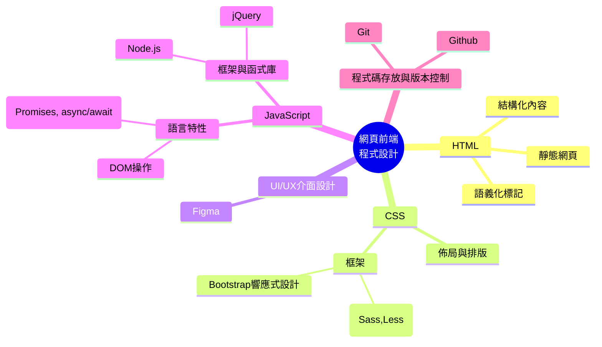

# git_practice
本專案是用於 Git 和 GitHub 的自我練習，適合剛開始學習版本控制的學生和開發者。透過本專案，你將熟悉如何操作 Git 的基本命令，並學習如何使用 GitHub 進行協作式開發。

## 目的
學習並掌握 Git 和 GitHub 的基本操作，包括複製儲存庫、進行變更、提交修改以及將變更推送到遠端儲存庫。這些都是日常軟體開發中的基礎技能。

## 要求
- 安裝好 Git。
- 有一個 GitHub 帳號。

# Try it
1. Fork 這個專案
2. Clone你所fork的專案到你本地的環境
3. 建立index.html，裡面的程式碼內容請ChatGPT幫忙寫自我介紹的HTML網站
4. Commit 你的內容
5. Push儲存庫到github上
6. 將自我介紹的網站部署到Github上
7. 將網站的網址Pull請求傳上去
8. 練習Markdown語法（可選）

# Markdown語法練習區⬇️⬇️⬇️
# H1標題
## H2標題
### H3標題
### H4標題

**粗體**
*斜體*
- 第一項
- 第二項
  - 子項
  - 子項
`這是程式`

``` python
# 這是PYTHON程式碼
print("Hello world")
```



$$
E=mc^2
$$
[Github](https://xianglibra.github.io/git_practice/)


> 這是一個引用
---

| 表頭一 |表投二 |
| ----- | ----- |
| 單元格1 | 單元格2 |
| 單元格3 | 單元格4 |
