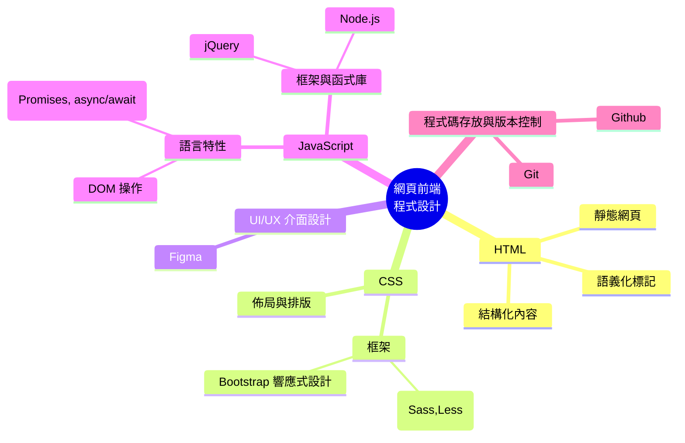

# git_practice
本專案是用於 Git 和 GitHub 的自我練習，適合剛開始學習版本控制的學生和開發者。透過本專案，你將熟悉如何操作 Git 的基本命令，並學習如何使用 GitHub 進行協作式開發。

## 目的
學習並掌握 Git 和 GitHub 的基本操作，包括複製儲存庫、進行變更、提交修改以及將變更推送到遠端儲存庫。這些都是日常軟體開發中的基礎技能。

## 要求
- 安裝好 Git。
- 有一個 GitHub 帳號。

# Try it
1. Fork 這個專案
2. Clone你所fork的專案到你本地的環境
3. 建立index.html，裡面的程式碼內容請ChatGPT幫忙寫自我介紹的HTML網站
4. Commit 你的內容
5. Push儲存庫到github上
6. 將自我介紹的網站部署到Github上
7. 將網站的網址Pull請求傳上去
8. 練習Markdown語法（可選）

# Markdown語法練習區⬇️⬇️⬇️
# H1 標題
## H2 標題
### H3 標題
#### H4 標題

**這是粗體**

*這是斜體*

- 第一項
- 第二項
  - 子項
  - 子項

1. 第一項
2. 第二項
   1. 子項
   2. 子項
   
`這是一行程式碼`

```python
# 這是Python程式碼區塊
print("Hello, World!")
```



$$
E = mc^2
$$

[GitHub](https://github.com/)


> 這是一個引用

---

區隔過後

| 表頭1 | 表頭2 |
| ----- | ----- |
| 單元格1 | 單元格2 |
| 單元格3 | 單元格4 |
